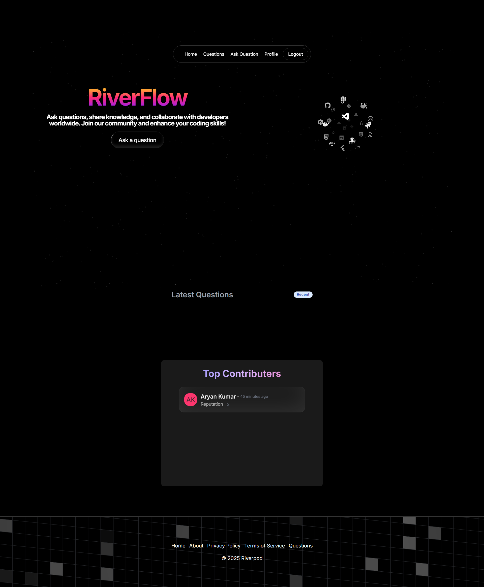

<div align="center">

# 🌊 Riverflow

<h3>A modern StackOverflow clone built with Next.js and Appwrite</h3>

[](https://riverflows.vercel.app)
[](./LICENSE)
[](https://nextjs.org/)
[](https://appwrite.io/)
[](https://www.typescriptlang.org/)

<br/>



<!-- *Note: Replace this with an actual screenshot of your application. A placeholder text file has been added at `public/riverflow-screenshot.png.txt`.* -->

<p>Riverflow is a modern Q&A platform inspired by StackOverflow, where users can ask questions, provide answers, vote on content, and contribute to a knowledge-sharing community.</p>

[Live Demo](https://riverflows.vercel.app) • [Report Bug](https://github.com/dev-username/riverflow/issues) • [Request Feature](https://github.com/dev-username/riverflow/issues)

</div>

## 📑 Table of Contents

- [✨ Features](#-features)
- [🔍 How It Works](#-how-it-works)
- [🛠️ Tech Stack](#️-tech-stack)
- [🚀 Getting Started](#-getting-started)
  - [Prerequisites](#prerequisites)
  - [Environment Setup](#environment-setup)
  - [Installation](#installation)
- [📁 Project Structure](#-project-structure)
- [🚀 Deployment](#-deployment)
  - [Deployment Steps](#deployment-steps)
- [💖 Acknowledgments](#-acknowledgments)
- [📬 Contact](#-contact)
- [👨‍💻 Meet the Author](#meet-the-author)

## ✨ Features

- **🔐 User Authentication** - Secure login/register functionality using Appwrite Auth
- **❓ Question Management** - Create, edit, and delete questions with rich text editing
- **✅ Answer System** - Post and manage answers to questions
- **👍 Voting System** - Upvote or downvote questions and answers
- **💬 Comments** - Add comments to questions and answers
- **👤 User Profiles** - View user activity, questions, answers, and votes
- **📝 Rich Text Editor** - Markdown support for writing questions and answers
- **📱 Responsive Design** - Fully responsive UI that works on all devices
- **🌓 Dark/Light Mode** - Theme toggle with next-themes
- **✨ Interactive UI** - Beautiful animations and interactive elements with Framer Motion

## 🔍 How It Works

Riverflow provides a comprehensive platform for developers to exchange knowledge through a structured Q&A format:

1. **User Registration & Authentication**

   - Create an account using email/password
   - Secure authentication managed through Appwrite Auth
   - User profiles track reputation and activity

2. **Asking Questions**

   - Create questions with a title, detailed description using rich text editor
   - Add relevant tags to improve discoverability
   - Attach files or code snippets when needed
   - Edit questions as long as they haven't received answers

3. **Community Interaction**

   - Answer questions with markdown support for code formatting
   - Upvote or downvote content based on quality and helpfulness
   - Add comments to questions and answers for clarification
   - Earn reputation points through positive engagement

4. **Knowledge Discovery**
   - Search for questions using keywords or tags
   - Browse trending questions on the homepage
   - View user profiles to see their contributions
   - Filter questions by various criteria

The application leverages Appwrite's backend services for authentication, database operations, and file storage, while Next.js provides the responsive front-end interface.

## 🛠️ Tech Stack

<table>
  <tr>
    <td align="center"><br/>Next.js 14</td>
    <td align="center"><br/>React 18</td>
    <td align="center"><br/>TypeScript</td>
    <td align="center"><br/>Tailwind CSS</td>
  </tr>
  <tr>
    <td align="center"><br/>Appwrite</td>
    <td align="center"><br/>Framer Motion</td>
    <td align="center"><br/>Radix UI</td>
    <td align="center"><br/>Zustand</td>
  </tr>
</table>

## 🚀 Getting Started

### Prerequisites

- Node.js 18.x or later
- npm or yarn
- Appwrite account and server setup

### Environment Setup

1. Copy the example environment file:

```bash
cp .env.example .env
```

2. Update the `.env` file with your Appwrite credentials:

```env
NEXT_PUBLIC_APPWRITE_HOST_URL=https://cloud.appwrite.io/v1
NEXT_PUBLIC_APPWRITE_PROJECT_ID=your_project_id_here
APPWRITE_API_KEY=your_api_key_here
```

**Important**: Never commit your `.env` file to version control as it contains sensitive credentials.

### Installation

1. Clone the repository

```bash
git clone https://github.com/dev-username/riverflow.git
cd riverflow
```

2. Install dependencies

```bash
npm install
# or
yarn install
```

3. Run the development server

```bash
npm run dev
# or
yarn dev
```

4. Open [http://localhost:3000](http://localhost:3000) with your browser to see the application.

## 📁 Project Structure

```
src/
  ├── app/              # Next.js App Router pages and API routes
  │   ├── (auth)/       # Authentication related pages (login/register)
  │   ├── api/          # API endpoints for questions, answers, votes
  │   ├── components/   # Page-specific components
  │   ├── questions/    # Question listing, details, and creation pages
  │   └── users/        # User profiles and activity pages
  ├── components/       # React components
  │   ├── magicui/      # UI animation and effect components
  │   └── ui/           # Basic UI components (buttons, inputs, etc.)
  ├── Models/           # Appwrite models and configurations
  │   ├── client/       # Client-side Appwrite configurations
  │   └── server/       # Server-side Appwrite configurations
  ├── store/            # Zustand state management
  ├── lib/              # Utility functions
  └── utils/            # Helper functions (slugify, time formatting)
```

The project follows a modular architecture with:

- **App Router**: Leveraging Next.js 14's app directory structure for routing
- **Component Library**: Reusable UI components with Tailwind CSS styling
- **Server Components**: Utilizing Next.js server components for data fetching
- **Client Integration**: Appwrite SDK for both client and server operations
- **State Management**: Zustand for lightweight and efficient state management

## 🚀 Deployment

The live version of this application is deployed on Vercel:

- **Live Site**: [https://riverflows.vercel.app](https://riverflows.vercel.app)
- **Status**: [](https://riverflows.vercel.app)

### Deployment Steps

To deploy your own instance of Riverflow:

1. **Set up Appwrite**

   - Create an Appwrite project and configure the necessary collections:
     - Questions, Answers, Comments, Votes
   - Set up Appwrite storage buckets for file attachments
   - Create API keys with appropriate permissions

2. **Configure Environment Variables**

   - Add the required Appwrite environment variables to your deployment platform

3. **Deploy to Vercel**

   ```bash
   vercel
   ```

   Or connect your GitHub repository to Vercel for automatic deployments.

4. **Alternative Deployment Options**
   - Deploy to Netlify, Azure Static Web Apps, or any other platform that supports Next.js

## 💖 Acknowledgments

- [Hitesh Chaudhary](https://github.com/hiteshchoudhary) - For the exceptional guidance
- [StackOverflow](https://stackoverflow.com/) - For the inspiration
- [Appwrite](https://appwrite.io/) - For the amazing backend-as-a-service
- [Next.js](https://nextjs.org/) - For the incredible React framework
- [Tabler Icons](https://tabler-icons.io/) - For the beautiful icons
- [Tailwind CSS](https://tailwindcss.com/) - For the utility-first CSS framework

## 📬 Contact

Have questions, suggestions, or want to contribute? Reach out through:

- **Email**: aryanak9163@gmail.com
<!-- - **Discord**: dev_username#1234 -->
- **GitHub Issues**: Create an [issue](https://github.com/aryankumarofficial/stackoverflow-appwrite-clone/issues) for bug reports or feature requests

I'm always happy to connect with fellow developers and users of this project!

---

<div align="center">
  <h3>Meet the Author</h3>

  <div style="display: flex; justify-content: center; align-items: center; gap: 20px; margin-bottom: 20px;">
    
    <div>
      <h4>Software Developer & Open Source Enthusiast</h4>
      <p>Passionate about building responsive web applications and sharing knowledge with the developer community.</p>
    </div>
  </div>

  <div style="margin-top: 20px;">
    <a href="https://github.com/aryankumarofficial" target="_blank"></a>
    <a href="https://linkedin.com/in/aryankumarofficial" target="_blank"></a>
    <a href="https://x.com/_aryankofficial" target="_blank"></a>
  </div>

<sub>Built with ❤️ by a passionate web developer</sub>

</div>
